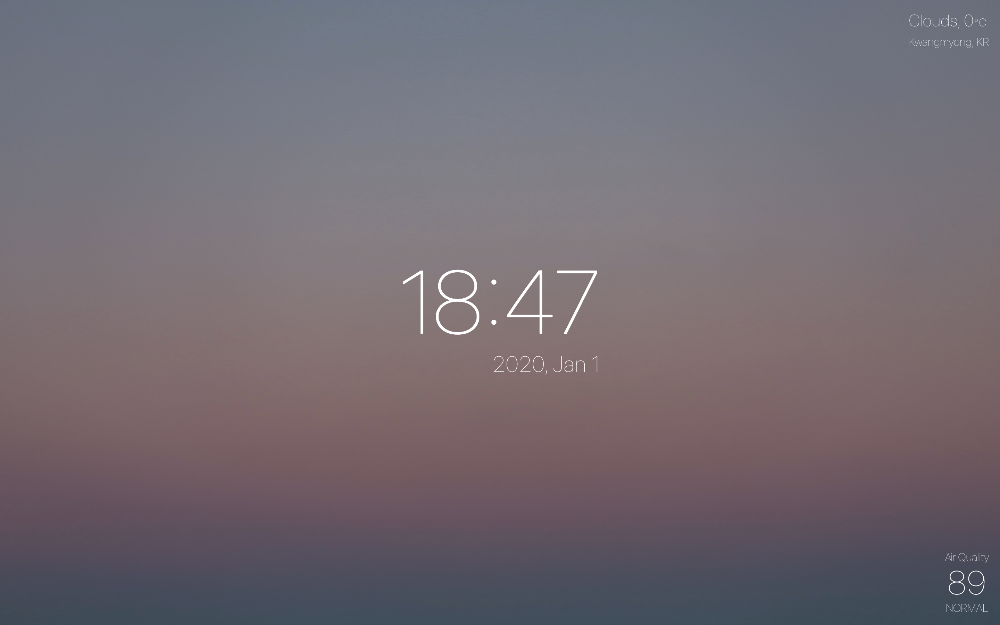

# Zarbis



내가 쓰고 싶어서 만드는, 매일 켜놓고 살 수 있는 대시보드 어플리케이션

- 시간
- 현재 위치 기반 날씨 정보
- 현재 위치 기반 미세먼지 정보

> [Live Demo](https://zarbis.herokuapp.com/)

## Installation
```bash
git clone https://github.com/evan-moon/zarbis.git
cd zarbis
yarn
```

```bash
yarn dev # 개발용 서버

yarn build # 빌드

yarn start # Express on
```
